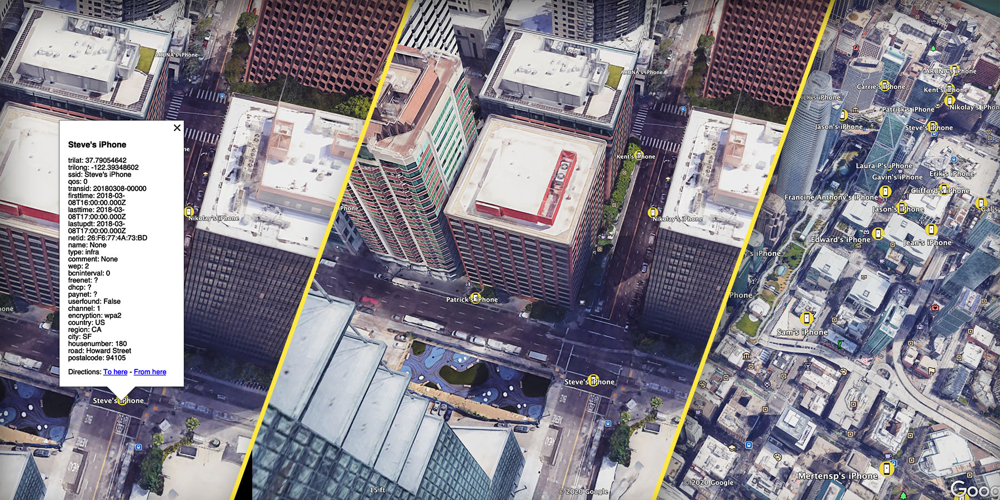

# Wigle {json2kml} Tool
Convert Wigle.net json result file to Kml. So it can be used in Google earth.

## Prerequisite
- Python 3+
- Python module: [simplekml](https://pypi.org/project/simplekml/)

## To install python required module:
```shell
pip3 install simplekml
```

## Usage:
1. Download the result json file using [wigle.net API](https://api.wigle.net/swagger)

2. Place the downloaded json file in the script folder.

3. Run the following command:
    ```shell
    python3 main.py -i <inputfile> -u <icon_url>
    ```
    > Change `<inputfile>` to the json file name.
    >
    > `-u` is optional parameter to change google earth default icon.

4. Open kml file on Google Earth

    
    